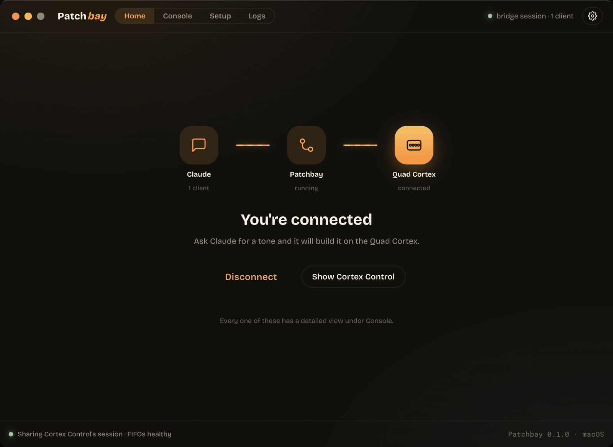
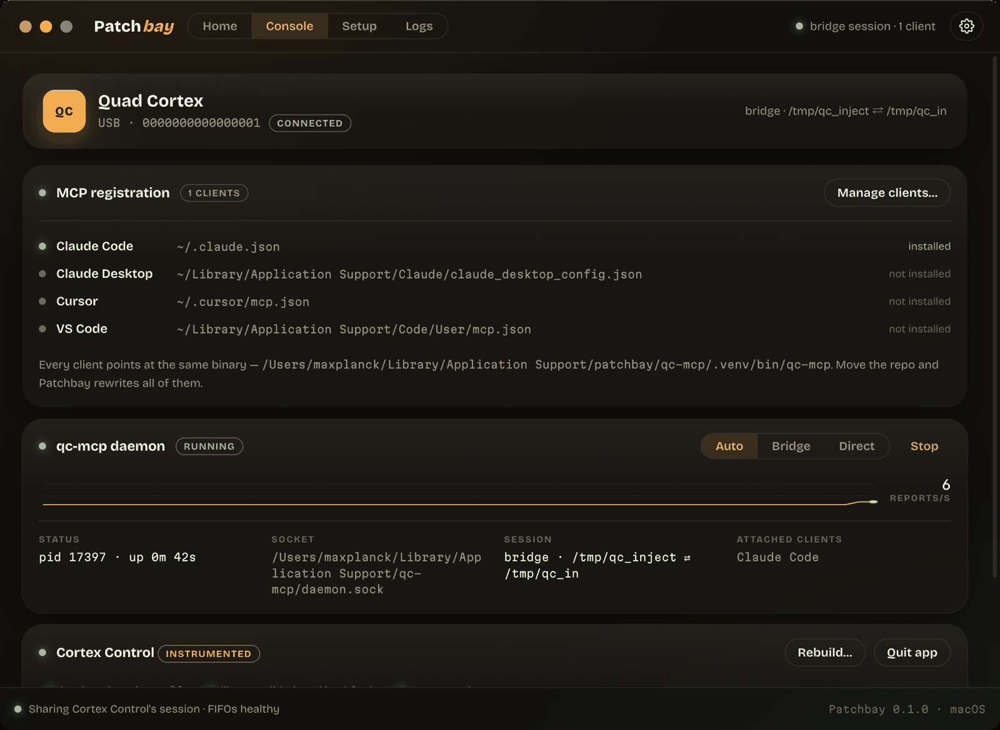
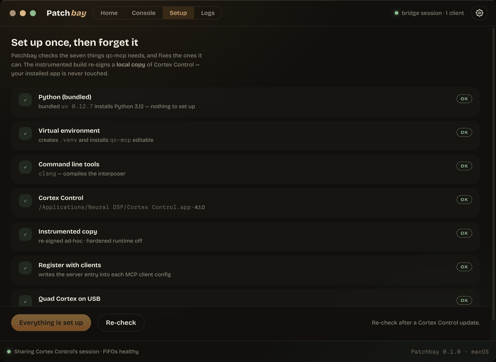
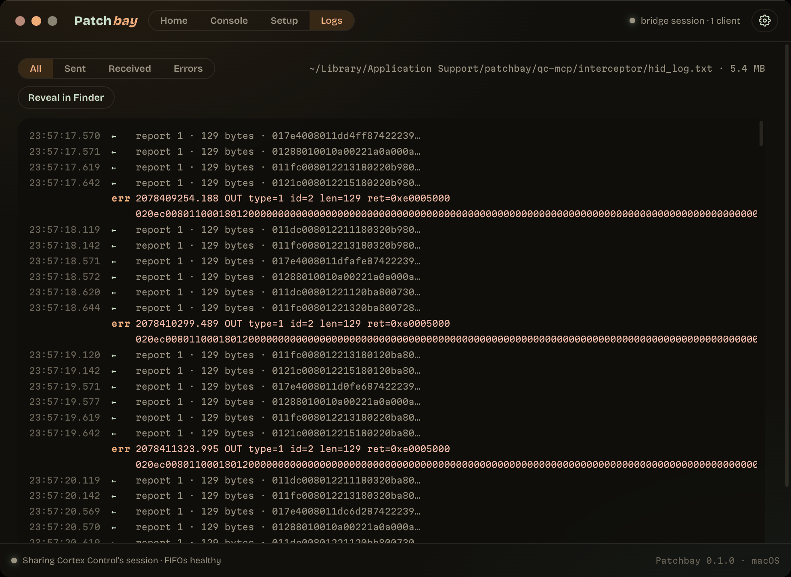

# Patchbay

Ask Claude for a tone and it builds it on your Quad Cortex. Patchbay is the
launcher that makes that true: it installs [qc-mcp](../README.md), registers the
server with your MCP clients, runs the daemon that owns the device, and opens
Cortex Control alongside it — so nobody has to remember `install.sh`,
`interceptor/build.sh` and `run-bridge.sh` in the right order.



Electron + React + TypeScript, built on
[@singz/ui](https://github.com/lexasoft123/singz-ui) — the night-studio design
language, in amber. Every colour is a `--sz-*` token and every control is a kit
component, so the class names (`pill`, `dot`, `mode-seg`, `modal-card`) are the
same contract SingZ uses.

**A fresh machine needs nothing pre-installed.** Not even Python: Patchbay
ships `uv`, which fetches its own CPython 3.12 and builds the environment in
about eight seconds. That gap is the whole reason — macOS's `/usr/bin/python3`
is 3.9.6, under the 3.10 the package needs, and Windows has none at all.

## What it does

- **One button** — Home shows the signal path, Claude → Patchbay → Quad Cortex,
  with each hop lit only when it is really live. **Connect** runs whatever is
  missing, in order: the environment, the instrumented build, the client
  registration, Cortex Control, the daemon. Press it again to disconnect.
- **Shares the device instead of fighting for it** — on macOS a DYLD interposer
  rides Cortex Control's own HID session, so the app and Claude both talk to the
  Quad Cortex at once. On Windows the daemon opens a second, non-exclusive
  handle beside the app. Either way you keep using Cortex Control while Claude
  edits presets.
- **One daemon, every client** — the daemon owns the device and fans
  device→host reports out to every attached MCP client, each with a disjoint
  `request_id` range so two can never mistake each other's replies. Claude Code,
  Claude Desktop, Cursor and VS Code can all be attached at the same time.
- **Setup that actually checks** — seven probes on macOS, five on Windows, each
  one a real measurement rather than a stored flag, with a fix for the ones
  Patchbay can perform. It never asks for your password.
- **The wire, live** — the Logs view parses the interposer's frame log as it is
  written: direction, report size, hex, and a filter for errors.
- **Your installed Cortex Control is never touched.** The instrumented build is
  a *local copy*, re-signed ad-hoc with the app's own entitlements carried over.

### Leveling — balance a setlist without walking the rig

Park the presets you want to balance on one strip. Patchbay loads them on the
device one at a time, so the arrow keys A/B them without touching the hardware,
and it remembers the scene each preset was left on.

The knob moves the **lane output** block — the level stored *in the preset*, so a
save makes the balance permanent. A preset with several output lanes moves as a
unit and keeps their relative balance; an internal merge bus is listed but left
alone, since trimming it as well would apply the same change twice. Each lane
also has its own ±0.5 dB trim.

The meters are the device's own `IOMeter` stream, converted from the linear
amplitude the QC sends onto the -40…+12 dB scale Cortex Control uses, with a
per-preset peak hold so you can compare a column you are not standing on.
Levels are written as you turn and read back afterwards, so the number on screen
is the device's, never an optimistic guess.

`⌘S` saves; **Auto-save** writes every change straight into the preset file (off
by default — this edits real presets).

### Console — every module, measured



Three independent modules: which client configs hold the server entry, the
daemon (mode, pid, socket, measured reports/s), and Cortex Control. The mode
selector switches auto / bridge / direct on a running daemon.

### Setup — seven real probes



### Logs — the interposer's frame log



## Install

Download the installer for your platform from
[Releases](https://github.com/lexasoft123/qc-mcp/releases) — `.dmg` on macOS
(Apple silicon and Intel), `.exe` on Windows.

The macOS `.dmg` is signed with a Developer ID certificate and notarized by
Apple, so it opens by double-clicking with no warning and no right-click
dance. Windows is **not** signed yet, so the `.exe` still needs
**More info** → **Run anyway** past SmartScreen.

Then press **Connect**. First run takes a couple of minutes, mostly building the
instrumented copy; after that it is a few seconds.

## What is real

Everything the main process reports is measured, not mocked:

| check | how |
|---|---|
| Python | the bundled `uv --version`, or a system `python3` / `py -3`, parsed and version-gated |
| venv | the `qc-mcp` entry point exists in `.venv` |
| clang | `clang --version` (macOS only) |
| Cortex Control | `Info.plist` via `defaults read`, or the exe's `ProductVersion` |
| instrumented copy | `codesign -dvvv` flags **and** the entitlements — both, because injection needs the hardened runtime off *and* library validation disabled |
| registration | each client's own config file is read for the `quad-cortex` key |
| device | `ioreg -p IOUSB` for vid `0x152a` / pid `0x880a` (Quad Cortex) or `0x892f` (Mini), or `Get-PnpDevice` |
| reports/s | counted from the interposer's own millisecond stamps in the last 2 s |

Installs are real too: `uv venv` + `uv pip install -e .` (or `python -m venv` +
`pip` when there is no bundled uv), `interceptor/build.sh` streamed line by
line, `claude mcp add` when the CLI is present (and a careful JSON merge into
the other clients when it is not — the server entry is the only key Patchbay
ever touches).

What ships in the installer and what gets built on your machine, and why:
**[docs/PACKAGING.md](../docs/PACKAGING.md)**.

## The daemon

`qc-mcp` grew a daemon so this launcher's model is real: **one process owns the
device, every client shares it.**

```
qc-mcp                                 stdio MCP server (unchanged default)
qc-mcp --daemon --socket PATH [--mode auto|bridge|direct]
qc-mcp --attach --socket PATH          stdio MCP server riding the daemon
```

The split sits as low as it can: the daemon moves *HID reports*, and framing,
gzip, protobuf, the catalog and the preset model still run inside each client.
Device→host reports are broadcast to every attached client — the same fan-out
the interposer's FIFO already does — and each client is handed a disjoint
request_id range at hello so two of them can never mistake each other's replies
for their own.

Patchbay spawns it, waits for the endpoint to actually accept a connection (a
socket file outlives a crashed daemon, so existence alone lies), and reports the
real stderr if it refuses to start.

**Order matters on macOS.** The daemon picks bridge vs direct once, at startup,
from whether the instrumented Cortex Control is already up — so Connect launches
the app *first* and waits for both FIFOs and the process before starting the
daemon. Starting the daemon first silently produces direct mode, which seizes
the device and leaves the interposer unused.

## Platform differences

They are not cosmetic, and they are not a runtime toggle — the main process
reports its own platform and the UI follows.

|  | macOS | Windows |
|---|---|---|
| sharing the device | DYLD interposer in a re-signed copy of Cortex Control | a second, non-exclusive HID handle |
| setup checks | 7 | 5 — no compiler, no instrumented copy |
| Cortex Control module | maintained (build, verify, rebuild on drift) | observed; the daemon works with the app closed |
| endpoint | unix socket | loopback port + a `.port` file |
| backdrop blur | yes | **no** — a Windows iGPU pays a full-window re-raster per blurred surface, which is why the kit's own `chrome.css` already drops it from the scrim |
| updates | checked, then you are handed the release page | downloaded in the background, installed on quit |

Both paths are exercised on real hardware: the daemon, its tests and two
concurrent attached clients have been run against a Quad Cortex on macOS and on
Windows 10, and the device probe, the loopback endpoint and the `.port` file are
verified there rather than inferred.

Windows **shared mode** is verified too — with Cortex Control running, the
daemon picks the second non-exclusive handle and serves attached clients while
the app keeps its own session. That is the case the "independent writers"
caution in the Console describes.

## Develop

```bash
npm install     # electron's postinstall must run — approve it if npm asks
npm run dev     # the app, with HMR
npm run build   # typecheck + bundle into out/
npm test        # the updater's pure logic (node --test, no build step)
npm run icons   # redraw build/icon.icns + .ico from build/icon/forge.html
```

The icon is drawn on canvas and cut with the same Chromium the app runs, so what
`forge.html` draws is what ships — a signal chain across the Quad Cortex Grid,
spiking. The full mark holds down to 48 px; 16 and 32 get a simplified one.

## Build & releases

```bash
npm run dist:mac     # -> dist/*.dmg  (arm64 and x64, one arch per invocation)
npm run dist:win     # -> dist/*.exe  (nsis)
```

`dist:*` fetches the pinned `uv` first. Tagging `v*` and pushing runs
[.github/workflows/release.yml](../.github/workflows/release.yml), which gates on
the offline Python suite, packages both platforms, and attaches the artifacts.

## Updates

Patchbay asks GitHub for the newest `v*` release every six hours (and three
seconds after launch), compares it with its own version, and shows a chip in the
rail when there is a newer one. Preferences has the switch that turns the
automatic check off, a **Check now** button that ignores it, and the last
result in words.

What happens when you press the chip differs by platform, and the reason is
packaging rather than trust:

- **Windows** gets the real thing. `electron-updater` reads `latest.yml` off the
  release, downloads the nsis installer in the background, and installs it the
  next time Patchbay quits — or immediately, from *Restart to update*.
- **macOS** gets a link to the release page. Squirrel.Mac installs from a `zip`
  feed and this app builds `dmg` only; electron-builder does not even write a
  `latest-mac.yml` for a dmg-only build. Giving macOS an in-place update means
  adding a zip target and putting a third artifact through Apple's notary queue
  on every release — worth doing, but its own piece of work.

Nothing is ever installed without a press, on either platform. An unpackaged
build never checks at all, since `app.getVersion()` there is whatever
`package.json` says.

Three environment variables exist for testing it:

| variable | effect |
|---|---|
| `PATCHBAY_TEST_UPDATER` | check even when unpackaged, and take the GitHub path on Windows too |
| `PATCHBAY_FAKE_VERSION` | the version to compare against, and what the rail shows |
| `PATCHBAY_UPDATE_URL` | point `electron-updater` at a generic feed directory instead of GitHub |

```bash
PATCHBAY_TEST_UPDATER=1 PATCHBAY_FAKE_VERSION=0.0.1 npm run dev   # "Get <latest>"
PATCHBAY_TEST_UPDATER=1 PATCHBAY_FAKE_VERSION=9.9.9 npm run dev   # "up to date"
```

`electron-updater` is the app's only runtime dependency, and it is a real one:
it must stay unbundled so it can read the `app-update.yml` electron-builder
packages beside it, which is why it sits in `dependencies` rather than
`devDependencies` like everything else here.

## One caveat worth knowing

A GUI-launched app on macOS does not inherit your shell's `PATH` — `launchctl
getenv PATH` is usually unset, so `~/.local/bin` is invisible and the `claude`
CLI cannot be found. Registration then falls back to editing each client's JSON
directly. That fallback is correct, but it means Claude Code's own config file
is rewritten by us rather than by its CLI, so prefer launching Patchbay from a
shell (or install `claude` somewhere on the default path) if you can.
